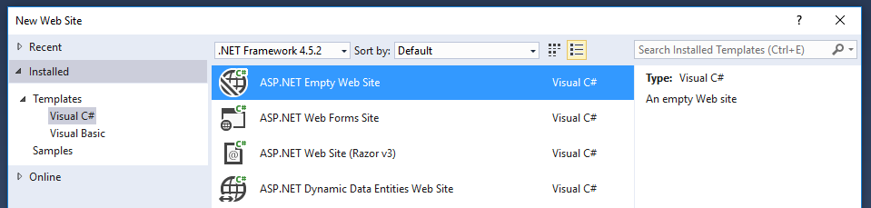
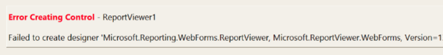

# Next steps - READ!

* **Make sure you have the latest version of [SQL Server Data Tools installed](https://msdn.microsoft.com/en-us/mt186501).** Earlier versions incorrectly GAC'ed certain libraries that will cause issues - see the common issues section  below.
* The Report Viewer Control is designed to be included in projects via nuget. It's not a good idea to add the libraries to the GAC.
* If deploying the control on an intranet site make sure that the page is targeting HTML5.

## Adding the Report Viewer Control to a new project

1. Create a new ASP.Net empty web site, or open an existing ASP.Net project 


2. Install the Report Viewer Control Nuget package via the Nuget package manager console
```
Install-Package Microsoft.ReportingServices.ReportViewerControl.WebForms.Preview
```
3. Add a new .aspx page to the project and register the Report Viewer Control assembly for use within the page
```
<%@ Register assembly="Microsoft.ReportViewer.WebForms, Version=13.0.0.0, Culture=neutral, PublicKeyToken=89845dcd8080cc91" namespace="Microsoft.Reporting.WebForms" tagprefix="rsweb" %>
```
4. Add a ScriptManagerControl to the page
5. Add the Report Viewer control to the page. The below snippet can be updated to reference a report hosted on a remote Report Server
```
<rsweb:ReportViewer ID="ReportViewer1" runat="server" ProcessingMode="Remote">
   <ServerReport ReportPath="" ReportServerUrl="" />
</rsweb:ReportViewer>
```

The final page should look like
```
<%@ Page Language="C#" AutoEventWireup="true" CodeBehind="WebForm1.aspx.cs" Inherits="Sample" %>

<%@ Register assembly="Microsoft.ReportViewer.WebForms, Version=13.0.0.0, Culture=neutral, PublicKeyToken=89845dcd8080cc91" namespace="Microsoft.Reporting.WebForms" tagprefix="rsweb" %>

<!DOCTYPE html>

<html xmlns="http://www.w3.org/1999/xhtml">
<head runat="server">
    <meta http-equiv="X-UA-Compatible" content="IE=edge" /> 
    <title></title>
</head>
<body>
    <form id="form1" runat="server">
    <asp:ScriptManager runat="server"></asp:ScriptManager>        
        <rsweb:ReportViewer ID="ReportViewer1" runat="server" ProcessingMode="Remote">
            <ServerReport ReportPath="http://AContosoDepartment/ReportServer" ReportServerUrl="/LatestSales" />
        </rsweb:ReportViewer>
    </form>
</body>
</html>
```

## Updating an existing project to use the Report Viewer Control

To make use of the 2016 Report Viewer Control in an existing project add the control via Nuget, and update assembly references to version 13.0.0.0. This will include updating the project’s web.config and all .aspx pages that reference the Report Viewer Control.

**Sample web.config changes**

```
<?xml version="1.0"?>
<!--
  For more information on how to configure your ASP.NET application, please visit
  http://go.microsoft.com/fwlink/?LinkId=169433
  -->
<configuration>
  <system.web>
    <compilation debug="true" targetFramework="4.5.2">
      <assemblies>
        <add assembly="Microsoft.ReportViewer.Common, Version=13.0.0.0, Culture=neutral, PublicKeyToken=89845DCD8080CC91"/>
        <add assembly="Microsoft.ReportViewer.DataVisualization, Version=13.0.0.0, Culture=neutral, PublicKeyToken=89845DCD8080CC91"/>
        <add assembly="Microsoft.ReportViewer.Design, Version=13.0.0.0, Culture=neutral, PublicKeyToken=89845DCD8080CC91"/>
        <add assembly="Microsoft.ReportViewer.ProcessingObjectModel, Version=13.0.0.0, Culture=neutral, PublicKeyToken=89845DCD8080CC91"/>
        <add assembly="Microsoft.ReportViewer.WebDesign, Version=13.0.0.0, Culture=neutral, PublicKeyToken=89845DCD8080CC91"/>
        <add assembly="Microsoft.ReportViewer.WebForms, Version=13.0.0.0, Culture=neutral, PublicKeyToken=89845DCD8080CC91"/>
        <add assembly="Microsoft.ReportViewer.WinForms, Version=13.0.0.0, Culture=neutral, PublicKeyToken=89845DCD8080CC91"/>
      </assemblies>
      <buildProviders>
        <add extension=".rdlc"
          type="Microsoft.Reporting.RdlBuildProvider, Microsoft.ReportViewer.WebForms, Version=13.0.0.0, Culture=neutral, PublicKeyToken=89845DCD8080CC91"/>
      </buildProviders>
    </compilation>
    <httpRuntime targetFramework="4.5.2"/>
    <httpHandlers>
      <add path="Reserved.ReportViewerWebControl.axd" verb="*"
        type="Microsoft.Reporting.WebForms.HttpHandler, Microsoft.ReportViewer.WebForms, Version=13.0.0.0, Culture=neutral, PublicKeyToken=89845DCD8080CC91"
        validate="false"/>
    </httpHandlers>
  </system.web>
  <system.webServer>
    <validation validateIntegratedModeConfiguration="false"/>
    <modules runAllManagedModulesForAllRequests="true"/>
    <handlers>
      <add name="ReportViewerWebControlHandler" verb="*" path="Reserved.ReportViewerWebControl.axd" preCondition="integratedMode"
        type="Microsoft.Reporting.WebForms.HttpHandler, Microsoft.ReportViewer.WebForms, Version=13.0.0.0, Culture=neutral, PublicKeyToken=89845DCD8080CC91"/>
    </handlers>
  </system.webServer>
</configuration>
```

**Sample .aspx**

```
<%@ Page Language="C#" AutoEventWireup="true" CodeBehind="WebForm1.aspx.cs" Inherits="SampleAspx" %>

<%@ Register assembly="Microsoft.ReportViewer.WebForms, Version=13.0.0.0, Culture=neutral, PublicKeyToken=89845dcd8080cc91" namespace="Microsoft.Reporting.WebForms" tagprefix="rsweb" %>

<!DOCTYPE html>
```


## Common issues

### Old version of SQL Server Data Tools is installed

If SQL Server Data Tools or SQL Server Management Studio for SQL 2016 is installed, make sure it's updated to the latest version. Earlier versions of SSDT incorrectly gac’ed certain dlls which conflict with the Report Viewer Control. You may need to manually delete the V13 dll's  from \windows\assembly\gac_msil to permanently remove them.

You may need to manually remove the libraries

```
gacutil /u "Microsoft.ReportViewer.WebForms, Version=13.0.0.0, Culture=neutral, PublicKeyToken=89845dcd8080cc91, processorArchitecture=MSIL" /f
gacutil /u "Microsoft.ReportViewer.WinForms, Version=13.0.0.0, Culture=neutral, PublicKeyToken=89845dcd8080cc91, processorArchitecture=MSIL" /f
gacutil /u "Microsoft.ReportViewer.WebDesign, Version=13.0.0.0, Culture=neutral, PublicKeyToken=89845dcd8080cc91, processorArchitecture=MSIL" /f
gacutil /u "Microsoft.ReportViewer.Common, Version=13.0.0.0, Culture=neutral, PublicKeyToken=89845dcd8080cc91, processorArchitecture=MSIL" /f
```


### Design time isn't currently supported

Design time and Control on the canvas experience for Visual Studio 2015 and Visual Studio 2016 is not yet supported. You will most likely see the image below if you use the new Report Control Runtime.



### Page is rendering in intranet compatability mode

The 2016 Report Viewer Control is designed to be used with modern browsers, the control may not function if browsers render the web page in an IE compatibility mode. Intranet sites may require a '<meta http-equiv="X-UA-Compatible" content="IE=edge" />' tag to override setting which encourage rendering intranet pages in compatibility mode.
